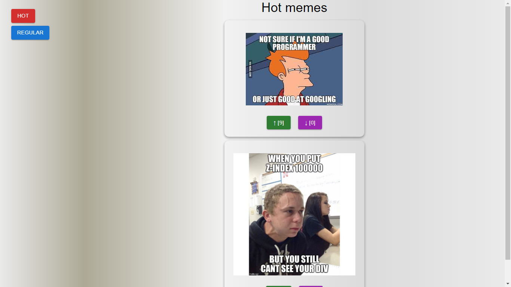

# Mem serwis - project

This project was bootstrapped with Create React App.

This is a simple React application which uses Material Design (MUI), Redux, React-Router and it is formatted with Prettier.

Using this application you can display a premade list of memes, give upvotes and downvotes for each of them and display a list of memes with a difference of 5 or more upvoted then downvotes (Hot memes) or display the memes which do not meet these requirements (Regular memes)

## How to install?

First, make sure that you've installed: Node.js and GIT Bash.

If you would like to install this application, you need to follow these steps:

Run the following command in you terminal/command prompt:
git clone https://github.com/szymonnalepa/jsmemes

Run the following command in the project directory:
`npm i`

Then, run the application with the following command:
`npm start`

Open http://localhost:3000 to view the application in your browser (if port is being used, the server will choose the next free port, follow the logs in the command prompt/terminal in order to view the port which is being used).
The page will reload when you make changes.

### Screenshot form the app (desktop platform):

